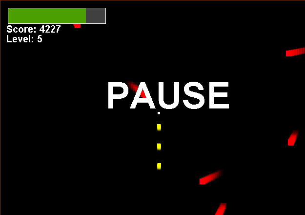

# BoxInvaders
Java game created with only Java Libraries and no game engine. It has 4 levels which it rotates through. The game goes on forever and you play for high-score.
Hacked togeter over a weekend. There are some bugs. Don't click too quickly on the menu screen :)

## Instructions
Very simple game. Use arrow keys to move. Space bar is pause. Use mouse to to click on menu screens.Dodge the projectiles, they will reduce your health bar. The color changing projectiles on every 4rth level will increase your health bar if touched. 

## Main Menu

## Help Menu

## Level 1 & Level2
### Level 1 and 2 look the same but level 2 has more projectiles.

## Level 3

## Level4

## Pause (press spacebar)

## DeathScreen

